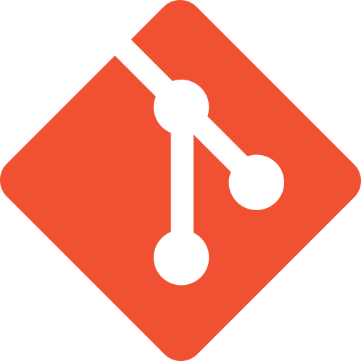

# G Linski
  

## About Me:
  

  Hey I'm Gabe. A programmer from Canada. Currently working through a program 
  at MITT to improve my skills.
  Once I'm a little more through the course, I'll actually have stuff to add 
  to this page.
  Right now I'm not too shabby at HTML, Python, JavaScript and CSS.
  In the near future I'd like to learn about database management and 
  app development.
  

  

  Outside of programming I enjoy playing volleyball and ultimate. 
  Though neither I'm considered particularly great at.
  I love country music, though I'm often scowled at for saying so. 
  Some other interests are board games, 
  puzzles, reading sci-fi, brewing beer and watching bad horror movies.
  

## Skills

  
  
  
  
  

## Non-Tech Interests
  - Ultimate Frisbee
  - Board Games
  - Brewing Beer
  - Volleyball

## Projects
  - One Day this will be filled

## Achievements
  - Currently an Empty Frame, Hopefully to Be Filled as Well

  | Badge | Description |
  | ----------- | ----------- |
  | Header | Title |
  | Paragraph | Text |

## The Stats Portion
  

